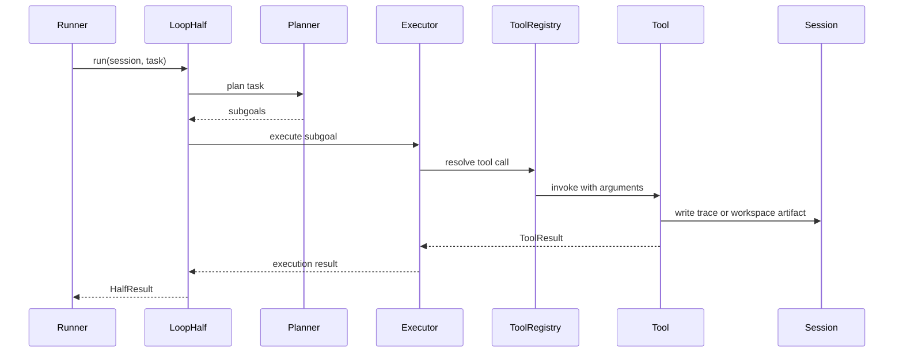
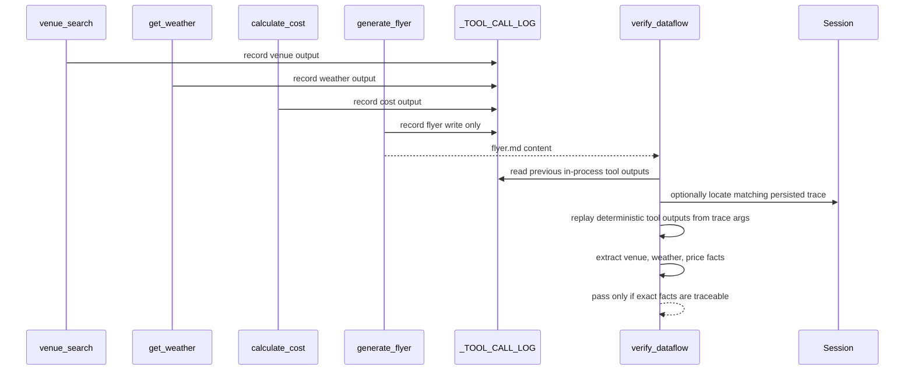
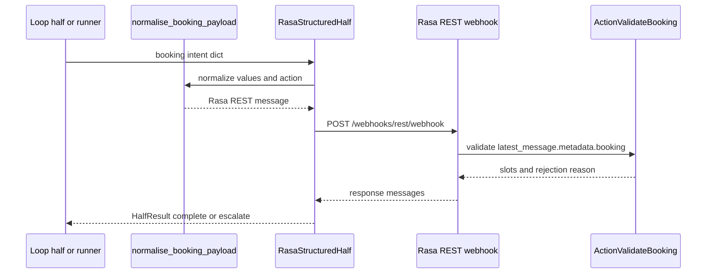
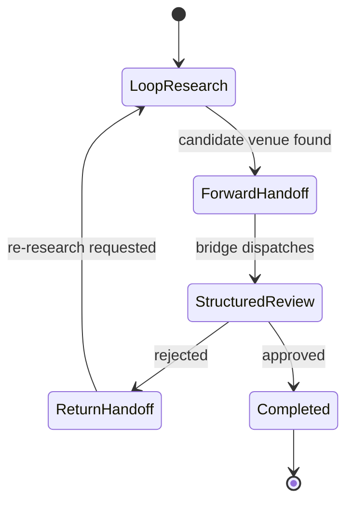
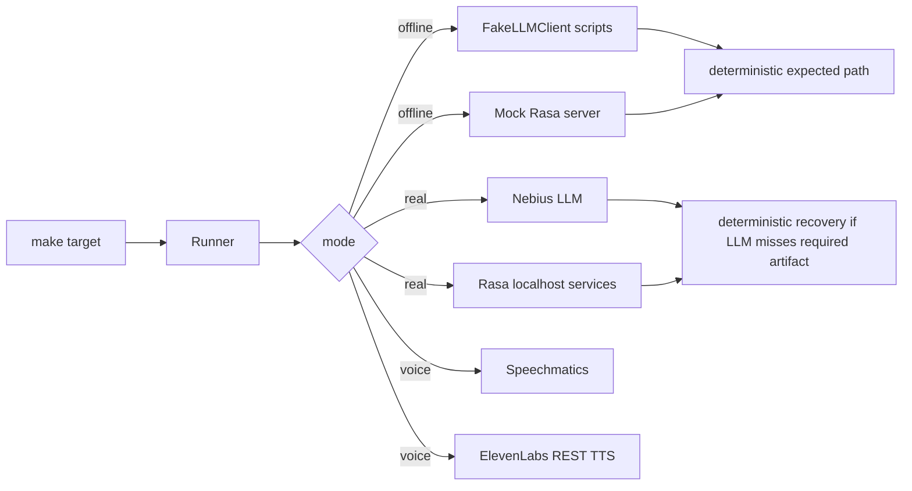
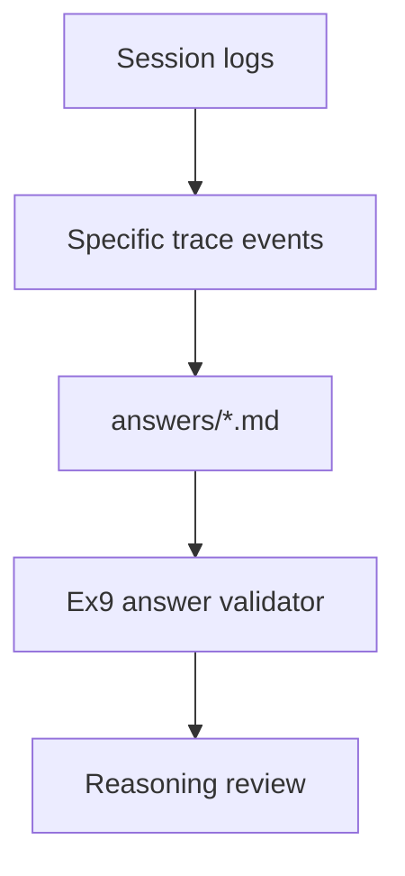

# Architectural Ideas

This page shows the reusable ideas behind the exercises. Each idea has its own
Mermaid diagram and a short explanation of why it exists.

## Loop Half Tool Execution

The loop half is allowed to plan, call tools, recover, and produce artifacts.
It is intentionally flexible, so it must be constrained by tool schemas,
session-scoped side effects, and post-run checks.

## Dataflow Integrity

The verifier protects against LLM fabrication. A fact in `flyer.md` must have
appeared in an earlier read or calculation tool result. The flyer write itself
does not verify its own content. When the check runs outside the original
process, it can reload persisted Ex5 evidence by matching the flyer and
replaying deterministic tool outputs from `trace.jsonl`.

## Structured Half Policy Boundary

The structured half is the policy boundary. It receives normalized booking data,
lets Rasa flows and actions decide, and returns a typed `HalfResult` instead of
free-form chat.

## Bidirectional Handoff

The Ex7 bridge demonstrates that a rejection is not a terminal failure. The
structured half can send a focused request back to the loop half, and the loop
half can produce a better candidate.

## Real and Offline Modes

Offline mode is for deterministic development and public tests. Real mode shows
the integration path but still needs guardrails because live LLMs can miss
required tool sequences.

## Trace-Grounded Reflection

Ex9 is not only essay writing. The intended architecture is evidence first:
answers should refer to observed session behavior, handoffs, tool calls, and
integrity failures.
