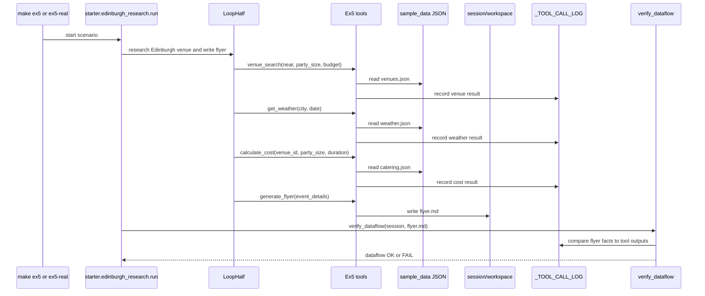

# Ex5 Edinburgh Research

## Goal

Ex5 demonstrates a complete loop-half scenario. The agent researches venues,
checks weather, calculates catering cost, writes a markdown flyer, and verifies
that concrete flyer facts came from tool outputs.

## Diagram

## What It Demonstrates

- Session-scoped tools can do real work while keeping side effects local.
- Read tools are parallel safe; `generate_flyer` is not parallel safe because it
  writes `workspace/flyer.md`.
- LLM-written final content is not trusted by default.
- The integrity check catches fabricated venue names, weather conditions,
  temperatures, and prices.

## Primary Code

- `starter/edinburgh_research/tools.py`
- `starter/edinburgh_research/integrity.py`
- `starter/edinburgh_research/run.py`
- `sample_data/venues.json`
- `sample_data/weather.json`
- `sample_data/catering.json`
