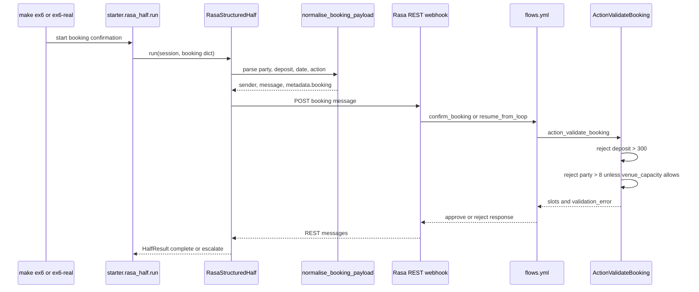

# Ex6 Rasa Structured Half

## Goal

Ex6 replaces a minimal in-process structured half with a Rasa-backed dialog
manager. Python normalizes booking data, Rasa owns the dialog flow, and a custom
action enforces booking policy.

## Diagram

## What It Demonstrates

- Rasa is the deterministic half for policy-heavy decisions.
- The Python validator is the boundary between loose LLM data and Rasa's REST
  message shape.
- The custom action reads `latest_message.metadata.booking` and sets slots.
- Flows cover the happy path, resumed handoff, and request-for-research path.
- Offline mock mode validates Python wiring without requiring a Rasa license.

## Primary Code

- `starter/rasa_half/validator.py`
- `starter/rasa_half/structured_half.py`
- `starter/rasa_half/run.py`
- `rasa_project/data/flows.yml`
- `rasa_project/actions/actions.py`
- `rasa_project/domain.yml`
