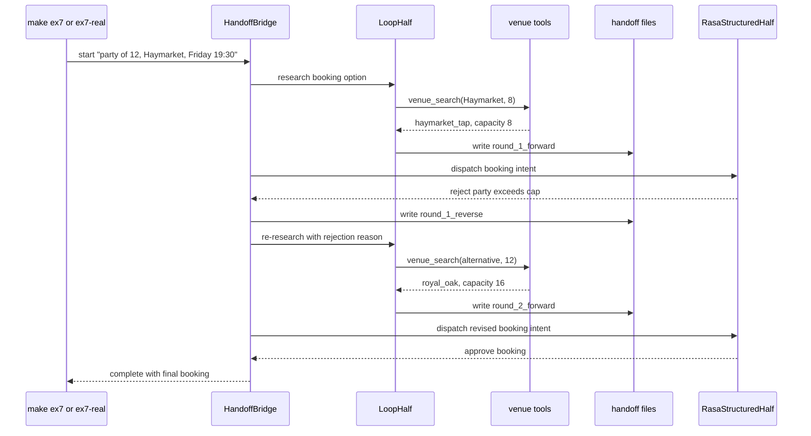

# Ex7 Handoff Bridge

## Goal

Ex7 demonstrates a bidirectional handoff round trip:

1. Loop half finds a candidate venue.
2. Structured half rejects it.
3. Bridge returns a focused research request to the loop half.
4. Loop half finds a better venue.
5. Structured half approves and the session completes.

The default run is deterministic. Real mode uses a live Nebius-backed loop half
first; if it fails to complete the full round trip, the runner creates a
separate recovery session with the deterministic loop while keeping the same
structured-half behavior.

## Diagram

## What It Demonstrates

- Handoffs are not one-way messages; the structured half can send the task back.
- The bridge is the glue layer between loop artifacts and structured decisions.
- Rejections should be actionable, for example "party exceeds cap".
- The final booking is produced only after the structured half approves.
- `ex7-real` uses a real LLM in the loop, while the default target uses a
  deterministic script and mock Rasa path.
- The first scripted search intentionally asks for 8 seats near Haymarket so the
  loop can discover `haymarket_tap`; the handoff then sends the real party size
  of 12 and venue capacity of 8 so the structured half can reject it.
- Handoff JSON is archived under `logs/handoffs/round_N_forward.json` and
  `round_N_reverse.json`, which makes the recovery path auditable.

## Primary Code

- `starter/handoff_bridge/bridge.py`
- `starter/handoff_bridge/run.py`
- `starter/rasa_half/structured_half.py`
- `starter/edinburgh_research/tools.py`
