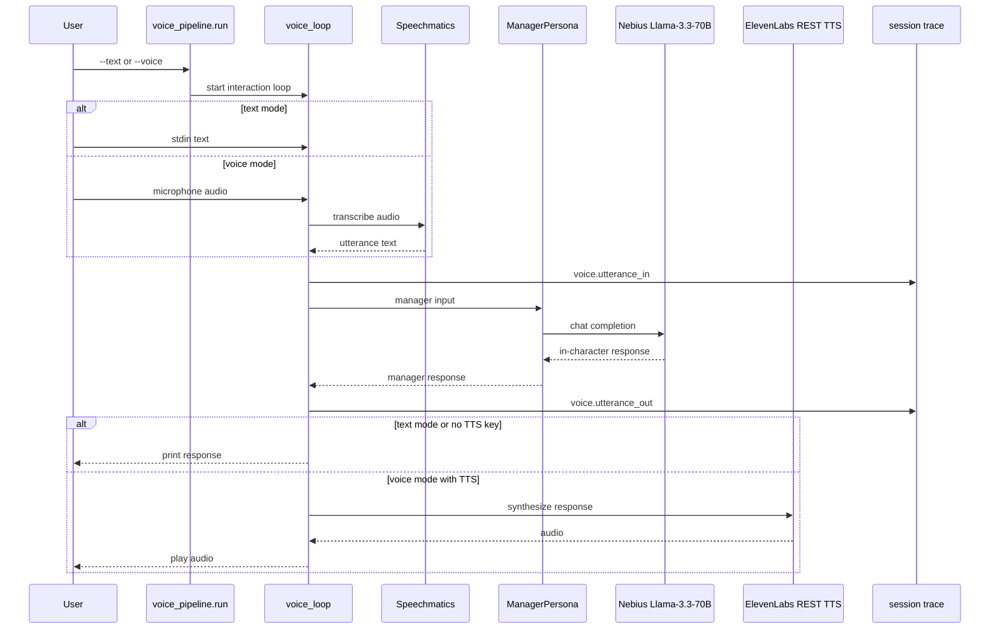

# Ex8 Voice Pipeline

## Goal

Ex8 demonstrates a voice or text interaction with a Llama-3.3-70B pub manager
persona. The manager speaks in character and accepts or declines bookings based
on party size and deposit policy. Text mode and voice mode write the same trace
event types so the downstream evidence model does not depend on the I/O mode.

## Diagram

## What It Demonstrates

- Text mode exercises the conversation logic without audio credentials.
- Voice mode adds Speechmatics STT and ElevenLabs REST TTS.
- Missing `SPEECHMATICS_KEY` degrades to text mode with a visible warning.
- Missing `ELEVENLABS_API_KEY` still allows STT and printed responses.
- Each turn is logged with `voice.utterance_in` and `voice.utterance_out`.
- Captured microphone input is written to `workspace/turn_<N>_input.wav` for
  debugging before transcription.

## Primary Code

- `starter/voice_pipeline/manager_persona.py`
- `starter/voice_pipeline/voice_loop.py`
- `starter/voice_pipeline/run.py`
- `starter/voice_pipeline/requirements-voice.txt`
