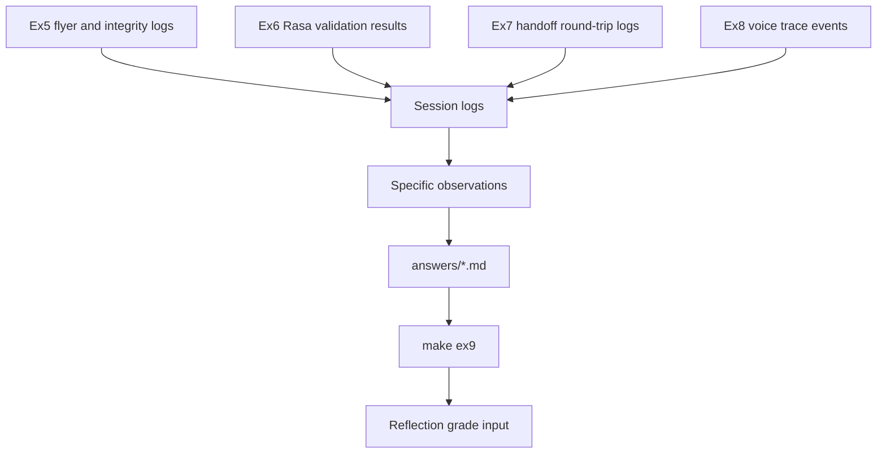

# Ex9 Reflection

## Goal

Ex9 demonstrates evidence-based reasoning. The answers should be grounded in
the session logs generated by Ex5 through Ex8 instead of generic descriptions.

## Diagram

## What It Demonstrates

- Conclusions should point to concrete events, session IDs, tool calls, or
  handoff transitions.
- A good answer explains what happened and why it matters for agent design.
- Ex7 is especially important because it shows when the planner chose to hand
  off, why the structured half rejected, and how the loop half recovered.
- Ex5 is important because it shows a practical anti-fabrication check.

## Primary Files

- `answers/*.md`
- session logs from `make logs`
- `docs/grading-rubric.md`
