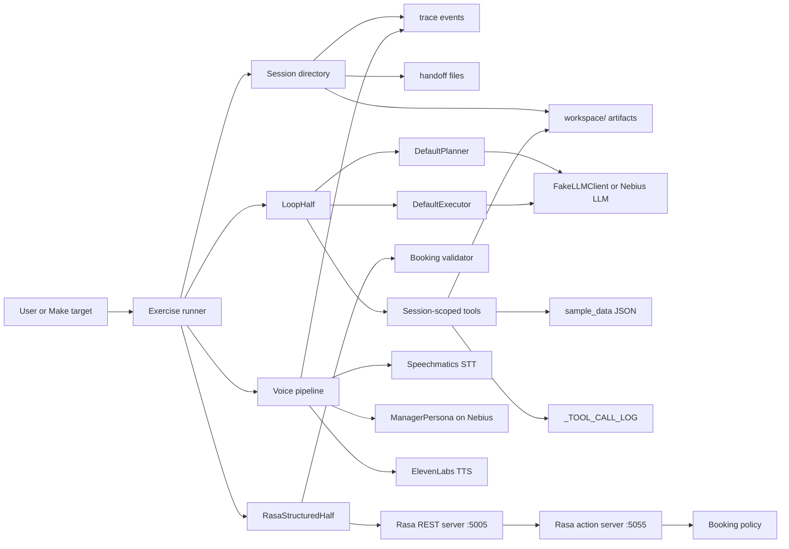
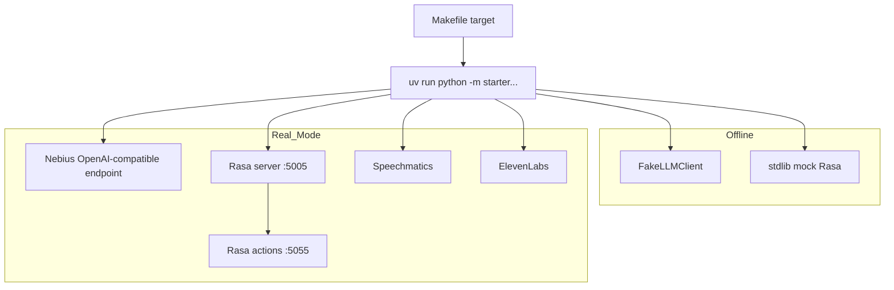
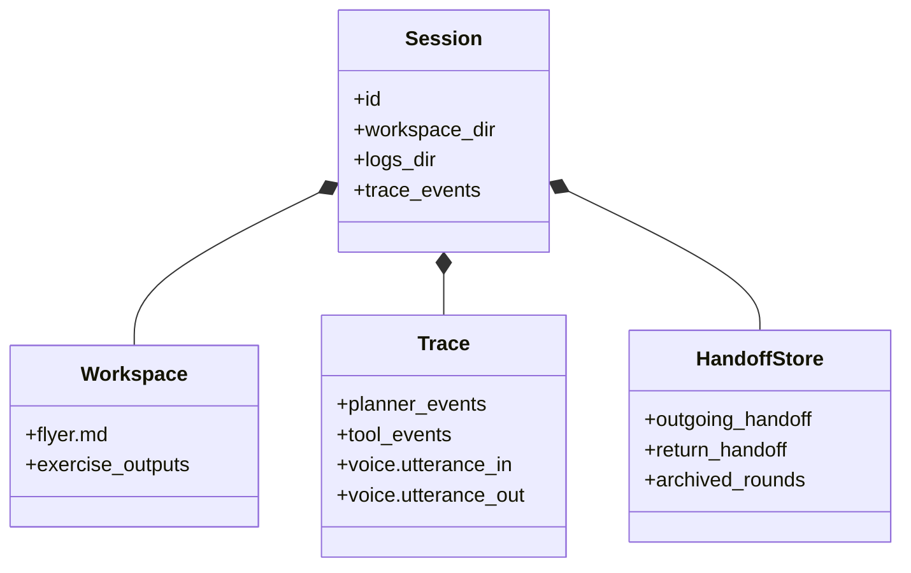

# System Overview

The project demonstrates a "two half" agent architecture. The loop half handles
open-ended planning and tool use. The structured half handles deterministic
dialog and policy decisions. Session directories provide the durable boundary
for traces, workspace files, and handoff payloads.

## Component View

## Local Runtime

## Session Artifact Model

The important design point is that every exercise leaves evidence in the
session. Ex5 produces a flyer and tool log. Ex7 archives the handoff round
trip. Ex8 logs each utterance. Ex9 should cite those traces instead of relying
on generic conclusions.
